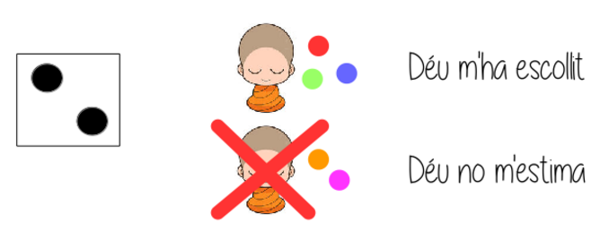

#FpExperiencies #DawMp03Uf04 #Programació

El Déu qui els va escollir
===========================
Un grup de monjos en el seu camí de peregrinatge cap a la seva muntanya sagrada es troben bloquejats en un port pendents d'aconseguir pujar al vaixell «Autopista» que els ha de portar fins al seu destí.

El problema és que com que han fet vot de pobresa no tenen prou diners per comprar bitllets per cada un.

Com que són monjos, no poden solucionar el problema fent servir la violència (a pesar de ser experts en Kungfu) sinó que decideixen solucionar-ho de forma més pacífica: amb un joc. 

*“Al cap i a la fi serà Déu el que decidirà qui pot anar amb el vaixell i qui no”*

El joc consistirà en posar-se en rotllana on cada monjo tindrà cinc pedres de colors i deixarà els diners que porta al mig. 

Quan tot estigui preparat: 
* Cada monjo agafarà amb la mà esquerra (la més propera al cor) el número de les pedres que
vulgui
* Un d'ells tirarà un dau i els monjos que tinguin el mateix número de pedres que el número que hagi sortit en el dau suïcidaran.
    * Per Déu ser afortunat en els jocs és un gran pecat. I com que no podran arribar a la muntanya sagrada s’han convertit en uns pecadors.
* Es repetirà el procés fins que puguin comprar bitllets per tothom o tothom s'hagi mort.

Desenvolupeu el programa que permeti definir el preu del bitllet del vaixell i a partir de la quantitat de diners que portin els monjos fer el «joc» per decidir quins són els afortunats

El programa haurà de determinar: 
* Quant val el bitllet de vaixell
* Quants monjos hi ha (cada monjo portarà una quantitat aleatòria de diners)

